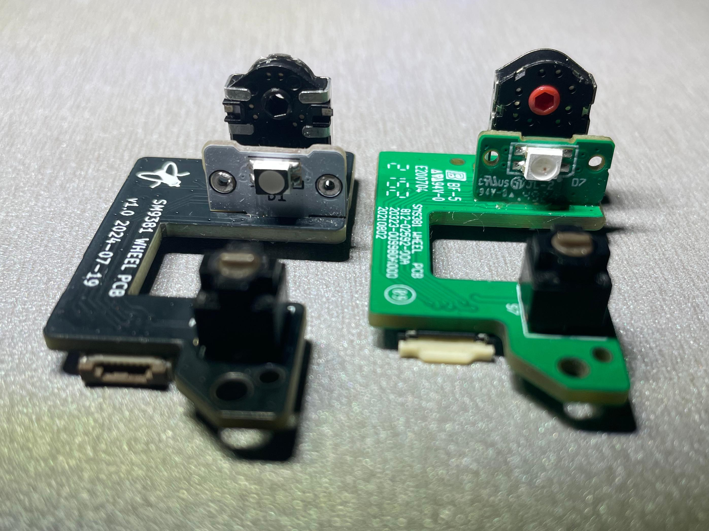
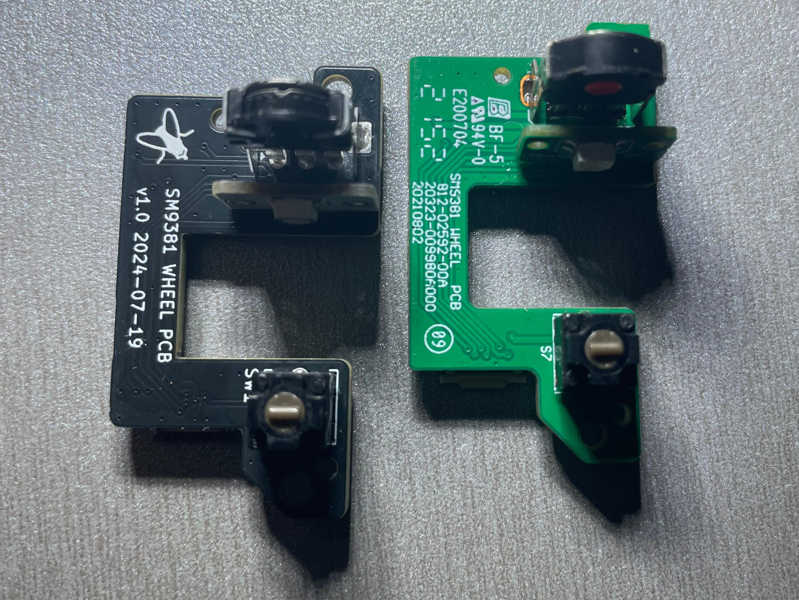
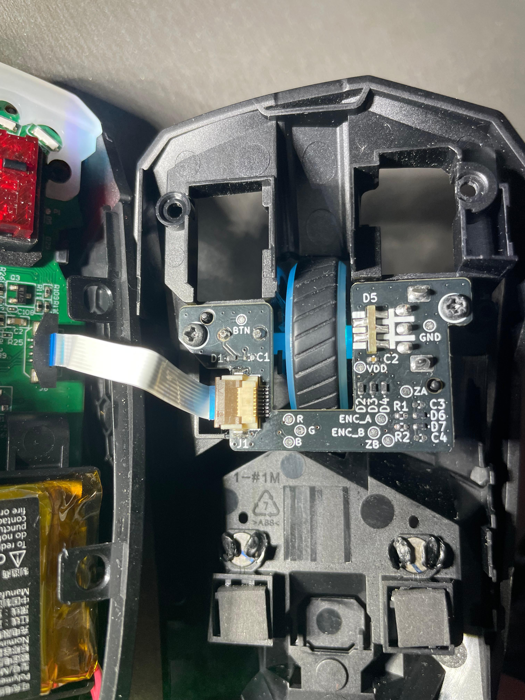

Chakram Scroll Wheel
===================

One day, scroll wheel on my Chakram X started misbehaving: sometimes scrolling in the wrong direction or not registering at all. After investigating, I concluded that the issue is most likely caused by a faulty encoder. Replacing it solved the problem, but I was no longer trusting the stock Kailh Red encoder, because the same issue was already reported online several times. To experiment with potentially higher-quality encoders without risking damage to the original part, I decided to recreate the entire scroll wheel PCB, staying as true to the original schematic and components as possible.

## Compatibility

| **Model**             | **Tested** | **Notes**                       |
| --------------------- | ---------- | ------------------------------- |
| Asus Chakram X        | ✅         | Fully functional                |
| Asus Chakram X Origin | ❓         | Untested, likely compatible     |
| Asus Chakram          | ❓         | Untested, compatibility unknown |
| Asus Chakram Core     | ❓         | Untested, compatibility unknown |

## Bill of materials

| Designator         | Footprint                     | Part link    |
|--------------------|-------------------------------|--------------|
| D1,D2,D3,D4,D6,D7  | SMD 0402 ESD protection       | [C1974929](https://www.lcsc.com/product-detail/C1974929.html )        |
| D5                 | *RGB LED daughterboard*       | [C2843813](https://www.lcsc.com/product-detail/C2843813.html)         |
| EN1                | Rotary encoder, 9mm height    | [688-EC10E1220501](https://mouser.com/ProductDetail/688-EC10E1220501) |
| J1                 | HRS(Hirose) FH12-8S-0.5SH(55) | [C597995](https://www.lcsc.com/product-detail/C597995.html)           |
| R1,R2              | 1k SMD 0402 Resistor          | [C11702](https://www.lcsc.com/product-detail/C11702.html)             |
| SW1                | EVQ-P0 series tactile switch  | [C395225](https://www.lcsc.com/product-detail/C395225.html)           |
 
Most of the parts listed are suggestions, and there are many compatible alternatives. This is particularly true for the encoder — selecting one depends on your personal preference, as different models vary in terms of tactility and scrolling force. I recommend starting with [this Reddit post](https://www.reddit.com/r/MouseReview/comments/18x4q6y/what_are_they_and_how_to_choose_mouse_encoders/) first, to see what's out there. 

However, regardless of the encoder you choose, **always use the 1k resistors** specified in the BOM. Do not use the resistor value mentioned in the encoder’s datasheet.

## Assembly

The board matches the original exactly, so simply connect the cable and screw it in.

#### Disclaimer

*This project is not affiliated with or endorsed by Asus. Use this design at your own risk. Ensure you follow proper safety protocols when handling electronic components and soldering.*